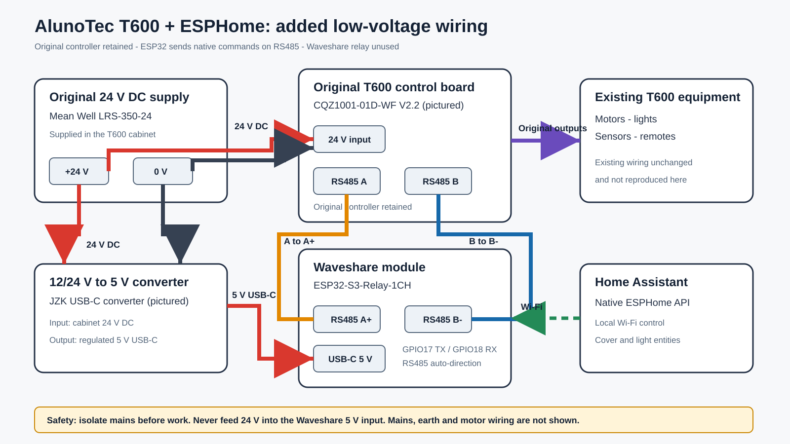

# AlunoTec T600 control from Home Assistant with ESPHome

This repository documents a working Home Assistant integration for an AlunoTec T600 pergola controller. A Waveshare ESP32-S3-Relay-1CH runs ESPHome and sends the T600's native command frames over its isolated RS485 interface.

## Does this bypass the T600 controller?

No. The original T600 controller remains installed and continues to control the motors, lights and original remotes. The ESP32 is an additional controller on the T600 RS485 bus. The relay built into the Waveshare unit is not used.



## Proven installation

The photographed installation uses:

- AlunoTec controller board marked `CQZ1001-01D-WF V2.2`
- the cabinet's original Mean Well `LRS-350-24` 24 V DC power supply
- a 12/24 V-to-5 V USB-C converter
- [Waveshare ESP32-S3-Relay-1CH](https://www.waveshare.com/wiki/ESP32-S3-Relay-1CH)
- Home Assistant with ESPHome

The Waveshare documentation confirms that its isolated RS485 interface uses GPIO17 for TX and GPIO18 for RX. It accepts **5 V only** at its power terminal or USB-C port; never connect the T600's 24 V supply directly to it.

## Wiring

Only the added low-voltage wiring is shown here. Existing T600 motor, light, remote, protective-earth and mains wiring remains unchanged.

| From | To |
|---|---|
| T600 cabinet 24 V DC supply | DC converter 12/24 V input, observing polarity |
| DC converter 5 V USB-C output | Waveshare USB-C input |
| Waveshare RS485 `A+` | T600 RS485 `A` |
| Waveshare RS485 `B-` | T600 RS485 `B` |
| Waveshare relay `NO` and `COM` | Not connected |

RS485 terminal naming can vary between products. Match `A` to `A+` and `B` to `B-` as installed here. If communication does not work, isolate power and verify the actual terminal markings and polarity instead of experimenting on a live cabinet.

## ESPHome setup

1. Copy `esphome/secrets.yaml.example` to `esphome/secrets.yaml`.
2. Replace every placeholder with your own values. Do not commit `secrets.yaml`.
3. Review the channel/address mapping below and adapt it to your pergola.
4. Validate and compile:

   ```sh
   esphome config esphome/pergola.yaml
   esphome compile esphome/pergola.yaml
   ```

5. Flash the Waveshare board by USB-C, then add the discovered ESPHome device to Home Assistant.

The supplied configuration passed the ESPHome `2026.8.2` configuration validator. Real electrical and mechanical testing is still required on the target pergola.

## Installation-specific channel mapping

These addresses were chosen for the reference installation and may need to be configured differently for a specific installation:

| Home Assistant entity | T600 motor address |
|---|---:|
| Pergola roof / louvre group | `0x11` |
| House blind | `0x02` |
| Front blind | `0x03` |
| Fence blind | `0x04` |
| Back blind | `0x05` |

Opening, closing and stopping use control command `0x03`, data address `0x01`, and values `0x01`, `0x02` and `0x00` respectively.

## RGB protocol discrepancy

The field-tested controller uses RGB preset values `0x00` through `0x07`:

| Preset | Working value |
|---|---:|
| Red | `0x00` |
| Green | `0x01` |
| Blue | `0x02` |
| Yellow | `0x03` |
| Cyan | `0x04` |
| Purple | `0x05` |
| White | `0x06` |
| Gradient | `0x07` |

AlunoTec's supplied *RS485 Pavilion Communication Protocol*, V1.0 dated 2024-05-09, lists those presets as `0x01` through `0x08`. Those one-based values did not match the installed controller. The YAML intentionally preserves the working zero-based values.

See [Protocol notes](docs/protocol-notes.md) for the frame layout and known limitations.

## Important limitations

- Cover positions are assumed rather than read back continuously.
- The roof uses a 25.5 second time-based estimate; recalibrate this for a different installation.
- The blind entities are optimistic.
- Status-query buttons log raw replies but the YAML does not parse replies into entity state.
- Command addresses and behaviour may vary with controller firmware and channel configuration.

## Safety and support

This is an unofficial, field-tested example—not an AlunoTec product, an installer service or a supported Home Assistant integration. It is provided without warranty. It may not suit another T600 revision or configuration.

The cabinet contains mains voltage and high-current motor/light circuits. Isolate it before inspection or wiring and use a qualified electrician or competent installer. Do not alter mains wiring, protective earth, motor outputs, safety devices or the original controller based on this repository.

This repository is not a customer-support channel and its issue tracker is disabled. Installation, compatibility and product-support questions should go to AlunoTec or the customer's installer.

## Licence

The example code and original diagrams in this repository are released under the [MIT License](LICENSE). AlunoTec and T600 are identifiers belonging to their respective owner; no affiliation or endorsement is implied.

